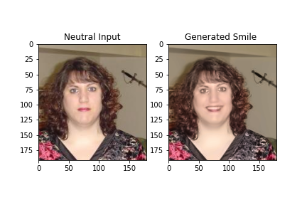
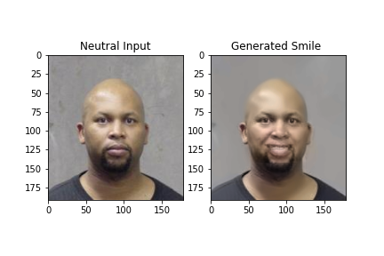
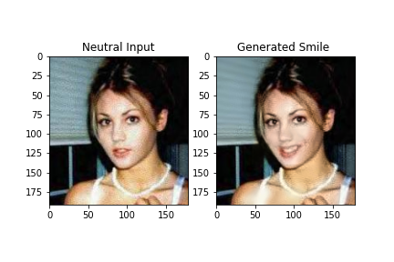
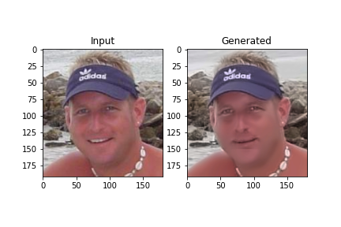
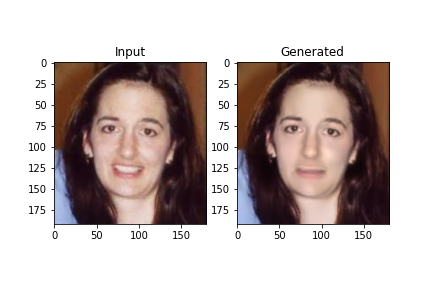
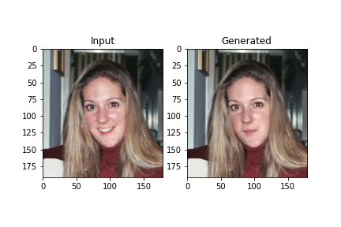

# Adding a smile to a photo of a person with CycleGAN

 - Using a CycleGAN we can train a model to add and remove a smile from an image of a person.
 - Trained using unpaired images of smiling and non smiling people using the [MPLab GENKI Database](https://inc.ucsd.edu/mplab/398.php)

# Sample Output - Added Smile

# Sample Output - Removed Smile

